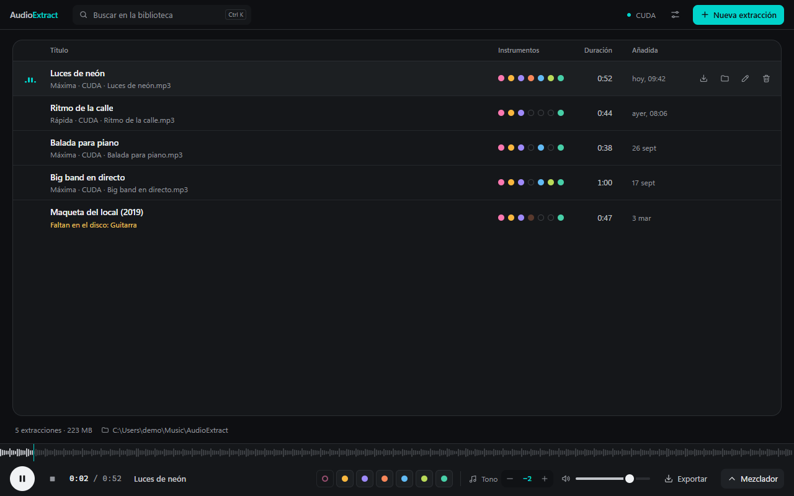

# AudioExtract

Separa una canción en pistas por instrumento — **voces, batería, bajo, guitarra, piano, viento y
otros** — en tu propio ordenador, con modelos abiertos de última generación. Escúchalas en un
mezclador sincronizado, **sube o baja semitonos** a una pista o a toda la canción, **cambia el
tempo** sin tocar el tono y **exporta** pistas sueltas o la mezcla en WAV o MP3. Cada extracción queda en una **biblioteca** para volver a
ella sin separarla otra vez.



<sub>Capturas del modo demo con canciones de ejemplo sintéticas.</sub>

## Qué hace

| | |
| --- | --- |
| **Instrumentos** | Voces, batería, bajo y otros siempre; guitarra, piano y viento (trompetas, saxos, flautas…) a elección. Lo que no pidas se queda en «Otros». |
| **Dos calidades** | *Máxima* con BS-RoFormer SW (la más limpia) o *Rápida* con Demucs v4. La app elige la adecuada según tengas GPU o no. |
| **Mezclador** | Volumen, mute y solo por pista, vúmetros, formas de onda y desplazamiento con clic o teclado. |
| **Semitonos** | ±12 por pista y ±12 globales, en tiempo real y sin cambiar el tempo (Signalsmith Stretch). Con 0 semitonos la pista suena idéntica al archivo. |
| **Tempo** | Del 50 al 150 % para toda la canción, en tiempo real y sin cambiar el tono, con los BPM estimados a partir de las pistas. Al 100 % y con 0 semitonos, la pista sigue sonando idéntica al archivo. |
| **Modo práctica** | El bajo, transcrito en tu equipo, en un mástil de 4 o 5 cuerdas y una tablatura que avanzan con la canción, al tempo que elijas, y siguen su transposición. |
| **Exportar** | Pistas sueltas o la mezcla que suena, en WAV 24/16 bits o MP3 320 kbps, aplicando (o no) volumen, tono y tempo. |
| **Biblioteca** | Carpeta normal (`Música\AudioExtract`) con una subcarpeta por canción: pistas WAV + `entry.json` con la mezcla guardada. |
| **Actualizaciones** | El instalador de una versión nueva se instala encima de la anterior sin preguntar y conserva todo; la app también puede avisar y actualizarse sola desde GitHub Releases. |
| **Privado** | El motor corre en un contenedor Docker **sin red**: el audio nunca sale de tu equipo. |

## Instalación rápida (Windows)

Necesitas **[Docker Desktop](https://www.docker.com/products/docker-desktop/)** (con WSL2) en marcha,
unos **20 GB libres** y, para que vaya rápido, una GPU NVIDIA con el driver al día (sin ella
funciona con la CPU, más despacio).

```powershell
git clone https://github.com/<usuario>/AudioExtract.git
cd AudioExtract
powershell -ExecutionPolicy Bypass -File scripts\install.ps1
```

El script construye el motor de separación (la primera vez descarga ~10 GB: PyTorch y los modelos),
compila el instalador dentro de Docker —no hace falta instalar Rust, Node ni Python— y lo abre.
Windows SmartScreen avisará porque el instalador no está firmado: *Más información → Ejecutar de
todas formas*.

La guía completa, con macOS, instalación sin Docker y solución de problemas, está en
**[docs/INSTALACION.md](docs/INSTALACION.md)**.

## Documentación

| Documento | Para |
| --- | --- |
| [INSTALACION.md](docs/INSTALACION.md) | Instalar desde el repositorio en Windows o macOS, actualizar y desinstalar. |
| [USO.md](docs/USO.md) | Usar la app: separar, mezclar, transponer, exportar, atajos de teclado. |
| [MODELOS.md](docs/MODELOS.md) | Qué modelo separa cada instrumento, calidad y tiempos medidos, límites. |
| [ARQUITECTURA.md](docs/ARQUITECTURA.md) | Cómo encajan la interfaz, el backend en Rust y el motor en Python. |
| [DESARROLLO.md](docs/DESARROLLO.md) | Preparar el entorno, modo demo en el navegador, tests, estructura del código. |
| [ACTUALIZACIONES.md](docs/ACTUALIZACIONES.md) | Publicar versiones, firmar actualizaciones y el instalador que actualiza encima. |
| [CHANGELOG.md](CHANGELOG.md) | Novedades de cada versión. |

## Cómo funciona, en una imagen

```
 Interfaz (React)  ──invoke──►  Backend (Rust/Tauri)  ──docker run --network none──►  Motor (Python)
   biblioteca, dock,              biblioteca en disco,          Demucs v4 · BS-RoFormer SW · UVR Wind
   mezclador, exportación         progreso, exportación         una línea JSON por mensaje en stdout
        ▲                                   │
        └── pistas WAV (protocolo asset:) ◄─┘
```

## Requisitos

| | Mínimo | Recomendado |
| --- | --- | --- |
| Sistema | Windows 10/11 x64 · macOS 13+ (Apple Silicon) | Windows 11 |
| Motor | Docker Desktop con WSL2 (Windows) · Python 3.10+ (macOS) | GPU NVIDIA con 4 GB de VRAM o más |
| Disco | 20 GB para el motor + ~40 MB por minuto de canción separada | SSD |
| Memoria | 8 GB | 16 GB |

## Licencias

El código de AudioExtract aún no tiene licencia elegida (pendiente del propietario del repositorio).
Usa componentes con licencias propias: Demucs y audio-separator (MIT), Basic Pitch (Apache-2.0, con su
modelo incluido en el paquete), Signalsmith Stretch (MIT),
Tauri (MIT/Apache-2.0), LAME a través de wasm-media-encoders (LGPL, cargado como archivo aparte) y los
pesos de cada modelo, que se descargan de sus repositorios oficiales al construir el motor (ver
[docs/MODELOS.md](docs/MODELOS.md)).
