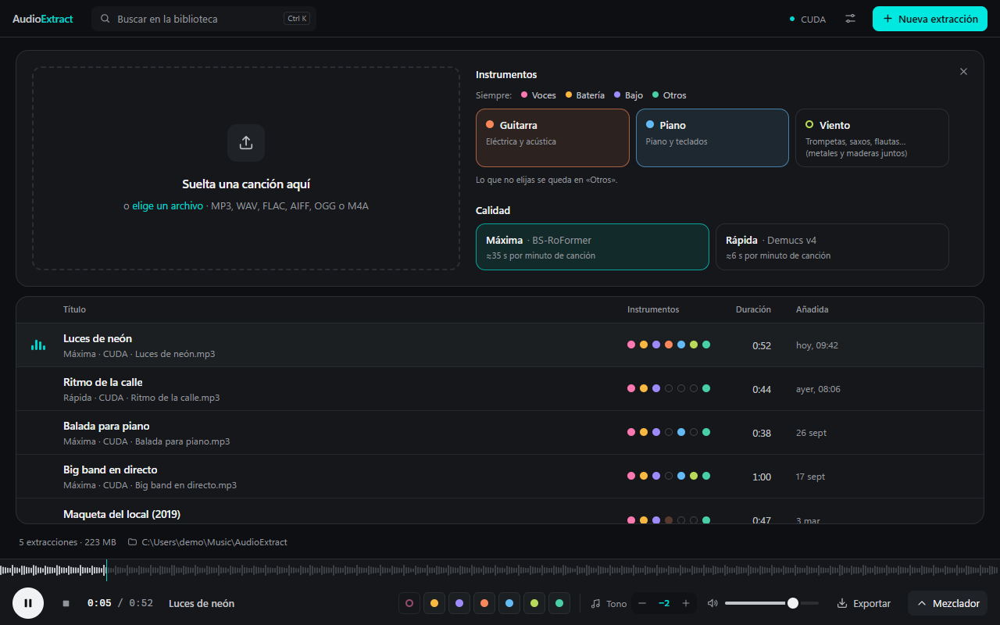
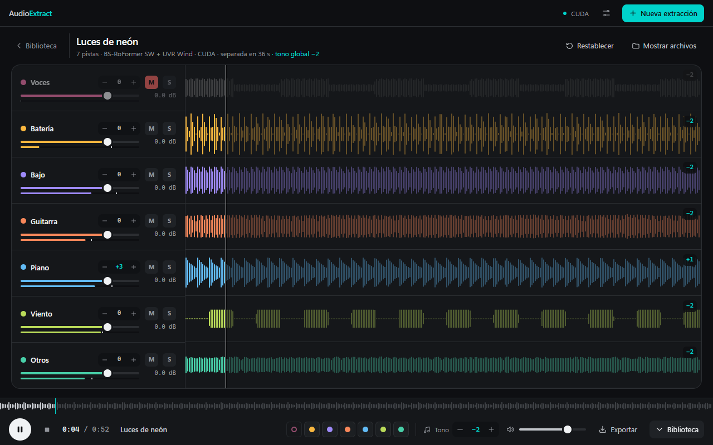
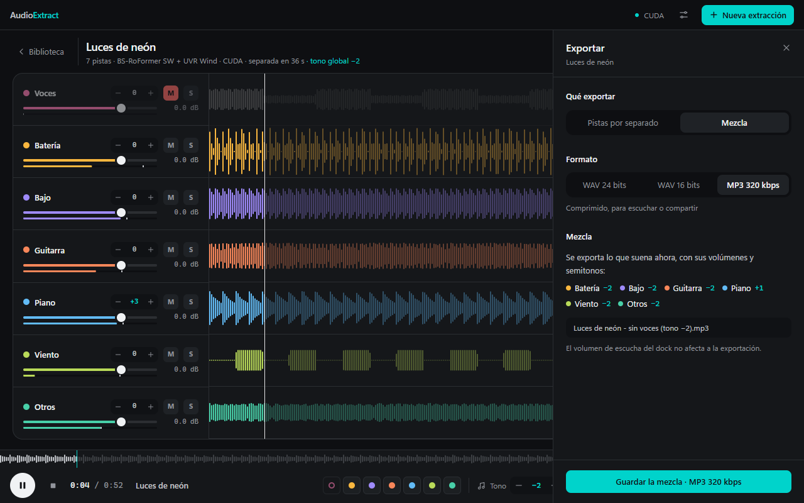

# Usar AudioExtract

<sub>Las capturas son del modo demo, con canciones de ejemplo sintéticas.</sub>

La ventana tiene tres zonas: la **barra superior** (buscar, estado del motor, ajustes y *Nueva
extracción*), la **biblioteca** con tus canciones separadas y, abajo, el **dock** con lo que suena.

## Separar una canción



1. Suelta un archivo de audio en cualquier parte de la ventana, o pulsa **Nueva extracción** y elige
   uno. Formatos: MP3, WAV, FLAC, AIFF, OGG y M4A.
2. En el panel que se abre, elige qué separar:
   - **Voces, batería, bajo y otros** se separan siempre.
   - **Guitarra**, **Piano** y **Viento** (trompetas, saxos, flautas… metales y maderas juntos) son
     opcionales. Lo que no elijas se queda dentro de «Otros».
3. Elige la **calidad**:
   - **Máxima** (BS-RoFormer): la separación más limpia. Con GPU tarda unos 35 s por minuto de canción.
   - **Rápida** (Demucs v4): unos segundos por minuto con GPU; la recomendada si no tienes GPU.

   Debajo de cada opción verás una estimación para tu equipo. La app recuerda tu elección.

La separación aparece como una fila con su progreso encima de la biblioteca. Mientras trabaja puedes
seguir escuchando y mezclando otras canciones. Al terminar, la canción entra en la biblioteca.

## La biblioteca

Cada fila muestra el título, la calidad y el acelerador con que se separó, y una **franja de siete
puntos**: uno por instrumento, siempre en el mismo orden (voces, batería, bajo, guitarra, piano,
viento, otros). Relleno = separado; hueco = no pedido. Así ves de un vistazo qué canciones tienen piano
o viento.

- **Clic en el título** (o Intro): carga la canción en el dock y empieza a sonar. Otro clic la pausa.
- **Doble clic en la fila**: abre el mezclador.
- Al pasar el ratón: **Exportar**, **Mostrar en la carpeta**, **Renombrar** y **Eliminar** (va a la
  papelera del sistema; si no se puede, la app te ofrece borrarla definitivamente).
- **Ctrl K**: buscar por título o nombre de archivo (ignora tildes).
- Abajo: cuántas extracciones hay, cuánto ocupan y la carpeta de la biblioteca (clic para abrirla).

La biblioteca es una carpeta normal: `Música\AudioExtract` por defecto (se cambia en *Ajustes*). Cada
canción es una subcarpeta autocontenida:

```
Música\AudioExtract\
└── Mi canción\
    ├── entry.json      título, fecha, modelos usados y la mezcla guardada
    ├── vocals.wav      WAV 16 bits / 44,1 kHz, una por instrumento
    ├── drums.wav
    └── …
```

Puedes copiarlas o moverlas entre bibliotecas: la app las reconoce solas.

## El dock

Siempre visible abajo, en la biblioteca y en el mezclador:

- **Reproducir/pausa**, **detener** y el tiempo. Encima, la forma de onda de lo que suena: haz clic o
  arrastra para moverte.
- **Puntos de color**: silencian o activan cada instrumento (hueco = silenciado).
- **Tono y tempo**, uno encima de otro, para **toda la canción**. El tono sube o baja semitonos. El
  tempo la acelera o la frena del 50 al 150 %, de 5 en 5, sin cambiar el tono. Con el foco en el valor:
  flechas ±5 %, RePág/AvPág ±25 %, y 0 o doble clic para la velocidad original.
- **BPM**: al lado del tempo, los que suenan ahora (los de la canción por el porcentaje elegido). Se
  estiman a partir de las pistas al abrir la canción, así que pueden salir el doble o la mitad del
  pulso que sientes: en un reggae, 140 en vez de 70. En una canción sin pulso claro no aparecen.
- **Volumen de escucha**: solo para oír más fuerte o más bajo; no afecta a la exportación.
- **Exportar** y **Mezclador** (abre o cierra el mezclador completo).

## El mezclador



Por cada instrumento:

- **Semitonos** (−12…+12): se suman a los globales del dock. El número de la derecha de cada onda
  muestra lo que suena de verdad en esa pista. La transposición no cambia el tempo; con 0 semitonos la
  pista suena exactamente igual que el archivo.
- **M** (mute) y **S** (solo). Si hay alguna pista en solo, solo suenan esas; el mute siempre gana.
- **Fader** de volumen (doble clic: 0 dB) y vúmetro.

En la cabecera, junto a los datos de la extracción, van los BPM estimados de la canción y, en
turquesa, el tono global y el tempo si los cambiaste. El tiempo del dock y las ondas siguen contando
en tiempo de la canción: al 50 %, un minuto de canción tarda dos en sonar.

**Restablecer** vuelve todo a 0 dB, sin mute ni solo, y al tono y el tempo originales. La mezcla
(volúmenes, mute, solo, semitonos y tempo) **se guarda sola** en la biblioteca y se recupera al
volver a abrir la canción.

Ideas de uso:

- **Practicar**: silencia tu instrumento, baja el tono de la canción a tu tesitura, y toca encima. Para
  sacar un pasaje difícil, frena el tempo al 70 % y súbelo poco a poco. Si tocas el bajo, usa el
  [modo práctica](#modo-práctica-bajo).
- **Karaoke**: silencia las voces y exporta la mezcla: se llamará «… - sin voces».
- **Producción**: aísla la batería con *S*, o transpón solo el bajo una octava (+12) para un remix.

## Modo práctica (bajo)

**Practicar**, en la pista de bajo del mezclador, dedica el mezclador entero al bajo:

- **Arriba**, los controles de la pista de bajo (volumen, semitonos, M y S) y un resumen: con cuántas
  cuerdas se toca, cuántas notas hay y si la tablatura está transpuesta. **Todas las pistas** vuelve
  al mezclador.
- **El mástil** marca las notas que suenan en su cuerda y traste (con su nombre), la parte de la cuerda
  que vibra y, en anillos que se intensifican, las que vienen en el próximo segundo y medio. La franja
  violeta es la **posición de la mano**: cuatro trastes, un dedo por traste.
- **La tablatura** avanza hacia la línea blanca («ahora»): cada número es el traste en esa cuerda y la
  barra que le sigue, su duración. **Haz clic en la tablatura** para saltar a ese momento.

La primera vez, el motor transcribe la pista de bajo en tu equipo (sin red, en CPU, unos segundos;
más si Docker estaba parado). La transcripción se guarda junto a la pista (`bass.notes.json`) y las
siguientes veces se abre al instante.

- **4 o 5 cuerdas**: si alguna nota baja de E1 (41,2 Hz), el mástil es de 5 cuerdas (B E A D G); si no,
  el estándar de 4 (E A D G).
- **Posiciones**: una nota puede tocarse en varios sitios (C#2 es el traste 4 de la A o el 9 de la E).
  La app elige las posiciones que menos te obligan a mover la mano en toda la frase.
- **Transposición**: la tablatura sigue los semitonos que suenan en el bajo (los suyos más los
  globales). Si una nota transpuesta no cabe en el mástil, se muestra una octava más arriba o más abajo.
- **Tempo**: mástil y tablatura avanzan al tempo que suena. Frena la canción desde el dock para seguir
  un pasaje rápido nota a nota.
- **Es una transcripción automática**: puede fallar en notas muy rápidas, muy graves o con restos de
  otros instrumentos en la pista. Sirve de guía para practicar, no como partitura exacta.
- Mientras el modo práctica está abierto, solo se mide el vúmetro del bajo.

## Exportar



Desde el dock, el mezclador o cualquier fila de la biblioteca:

- **Pistas por separado**: elige cuáles. Se guardan en `<carpeta elegida>\<título> - pistas\` como
  `<título> - Voces.wav`, etc. Con **Aplicar el volumen, el tono y el tempo del mezclador**, cada pista
  sale con su volumen, sus semitonos (más los globales) y el tempo global, y el nombre lo indica:
  `… - Piano (tono +2, tempo 80 %).wav`. Sin marcar, salen tal cual se separaron.
- **Mezcla**: exporta exactamente lo que suena (mute, solo, volúmenes, semitonos y tempo) en un solo
  archivo. El nombre describe la mezcla: «mezcla», «sin voces», «voces + piano», con el tono y el
  tempo si los cambiaste. Con otro tempo el archivo dura más o menos que la canción, y el panel dice
  cuánto. Si la suma satura, se baja lo justo y la app te dice cuántos dB.
- **Formato**: WAV 24 bits (para tu DAW), WAV 16 bits (calidad CD; las pistas sin cambios se copian
  idénticas a las de la biblioteca) o MP3 320 kbps.

## Ajustes

- **Biblioteca**: abrir la carpeta, cambiarla o volver a la predeterminada. Al cambiar de carpeta, las
  extracciones anteriores se quedan donde estaban (puedes moverlas a la nueva).
- **Motor de separación**: acelerador (CUDA, Metal o CPU), calidades e instrumentos disponibles, si
  puede transcribir el bajo para el modo práctica, versión y avisos. **Comprobar de nuevo** tras abrir
  Docker o actualizar el motor.
- **Actualizaciones**: versión instalada, buscar actualizaciones e instalarlas (si la compilación las
  tiene configuradas; ver [ACTUALIZACIONES.md](ACTUALIZACIONES.md)).

## Atajos de teclado

| Tecla | Acción |
| --- | --- |
| Espacio | Reproducir o pausar |
| ← → | Retroceder o avanzar 5 s |
| Inicio | Volver al principio |
| M | Abrir o cerrar el mezclador |
| Ctrl K | Buscar en la biblioteca |
| Ctrl N | Nueva extracción |
| ↑ ↓ | Moverse por las filas de la biblioteca (Intro reproduce) |
| Esc | Cerrar paneles |
| Doble clic en un fader | 0 dB |
| Doble clic en un tono | Tono original (también la tecla 0 con el control enfocado) |
